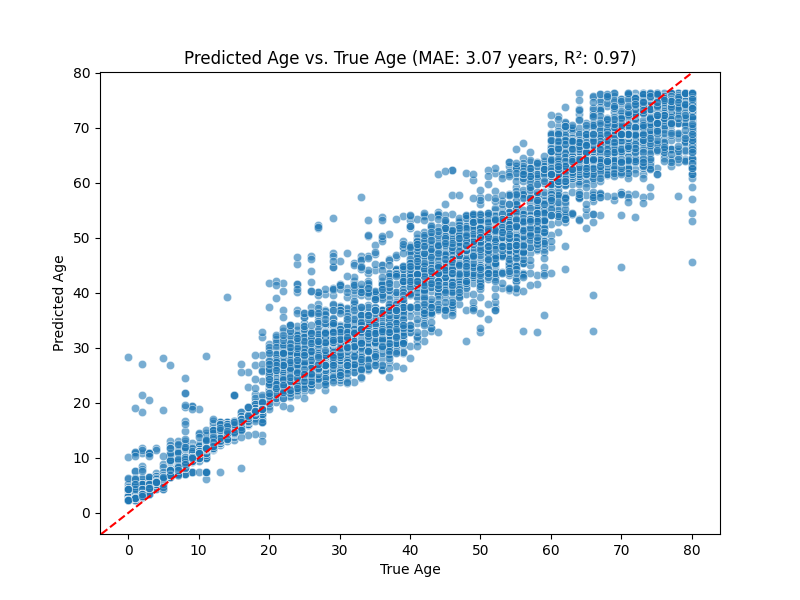
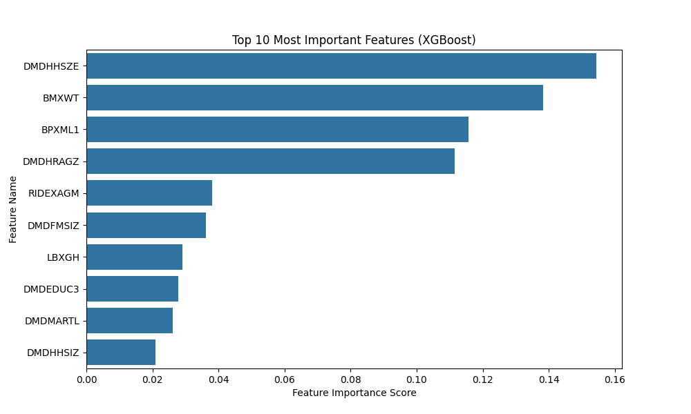
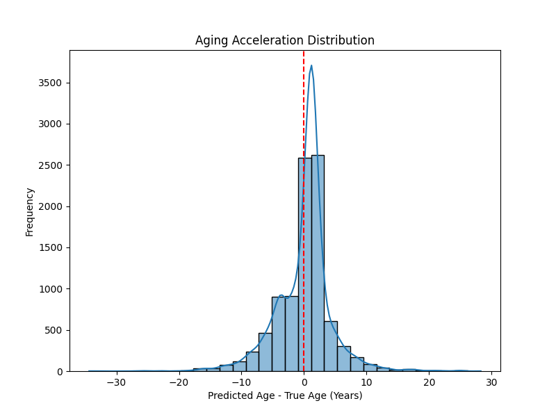

# AI-Based Biological Age Prediction using Biomarkers

## Overview
Biological age is often a more accurate indicator of an individual's health and aging process than chronological age. This project utilizes machine learning to predict biological age based on various biomarkers and lifestyle factors using data (~9200 entries) from the National Health and Nutrition Examination Survey (NHANES).

## Dataset
- **Source:** [NHANES](https://www.cdc.gov/nchs/nhanes/index.html)
- **Key Features:**
  - **Demographics:**
    DEMO_J.xpt
  - **Examination:**
    - BMX_J.xpt: Body measurements (e.g., weight, height, BMI).
    - BPX_J.xpt: Blood pressure readings.
    - LUX_J.xpt: Liver ultrasound measurements.
  - **Laboratory:**
    - ALB_CR_J.xpt: Albumin and creatinine levels.
    - BIOPRO_J.xpt: General biochemistry test results.
    - CBC_J.xpt: Complete blood count results (e.g., red and white blood cells, hemoglobin).
    - GHB_J.xpt: Glycohemoglobin levels.
    - GLU_J.xpt: Blood glucose levels.
    - HDL_J.xpt: High-density lipoprotein (HDL) cholesterol levels.
    - HSCRP_J.xpt: High-sensitivity C-reactive protein levels, an inflammatory marker.
    - INS_J.xpt: Insulin levels.
    - TCHOL_J.xpt: Total cholesterol levels.
    - TRIGLY_J.xpt: Triglyceride levels.
  - **Questionnaire:**
    - ALQ_J.xpt: Alcohol consumption questionnaire responses.
    - PAQ_J.xpt: Physical activity questionnaire responses.
    - SMQ_J.xpt: Smoking behavior questionnaire responses.
- **Preprocessing:**
  - Missing values are imputed (using medians for numerical features).
  - Features with excessive missing values are dropped (>80%)

## Machine Learning Models
- **Random Forest**
- **XGBoost**
- **Stacked Model (Meta-Learning):**
  - Combines predictions from the Random Forest and XGBoost models using a meta-model.
- **Tuning & Validation:**
  - Hyperparameter tuning with GridSearchCV.
  - Performance evaluation using K-Fold Cross-Validation.

## Results
- **Best Model:** Stacked Model (RF + XGBoost)
- **Performance Metrics:**
  - **Mean Absolute Error (MAE):** ~3.3 years
  - **R² Score:** ~0.95–0.97
  - 
## Visualizations
  - **Scatter Plot:** True Age vs. Predicted Age.
  - **Feature Importance:** Top biomarkers influencing the prediction.
  - **Age Gap Distribution:** Histogram showing the difference between predicted and actual ages.
  - 
### 1. Scatter Plot: True Age vs. Predicted Age
This plot compares the true chronological ages with the predicted ages from the stacked model. The red diagonal line represents perfect predictions.


### 2. Feature Importance
This bar chart displays the top 10 most important features (biomarkers) used by the XGBoost model to predict biological age.


### 3. Age Gap Distribution
This histogram shows the distribution of the difference between predicted age and true age (Age Gap), indicating the model’s bias toward age acceleration or deceleration.



## Repository Structure
```
.
├── LICENSE.txt
├── README.md  
├── data
│   ├── demographics    
│   │   └── DEMO_J.xpt  
│   ├── examination     
│   │   ├── BMX_J.xpt   
│   │   ├── BPX_J.xpt   
│   │   └── LUX_J.xpt   
│   ├── laboratory      
│   │   ├── ALB_CR_J.xpt
│   │   ├── BIOPRO_J.xpt
│   │   ├── CBC_J.xpt   
│   │   ├── GHB_J.xpt   
│   │   ├── GLU_J.xpt   
│   │   ├── HDL_J.xpt   
│   │   ├── HSCRP_J.xpt 
│   │   ├── INS_J.xpt   
│   │   ├── TCHOL_J.xpt 
│   │   └── TRIGLY_J.xpt
│   └── questionnaire
│       ├── ALQ_J.xpt
│       ├── PAQ_J.xpt
│       └── SMQ_J.xpt
├── models
│   ├── biological_age_rf.pkl
│   ├── biological_age_xgboost.pkl
│   ├── stacked_meta_model.pkl
│   ├── stacked_random_forest.pkl
│   └── stacked_xgboost.pkl
├── notebooks
├── reports
│   ├── cleaned_dataset.csv
│   ├── dataset_summary.xlsx
│   ├── final_dataset.csv
│   ├── missing_values.csv
│   ├── visualization_1_scatter_v2.png
│   ├── visualization_2_feature_importance_v2.png
│   └── visualization_3_age_gap_v2.png
├── requirements.txt
└── src
    ├── check_model_validity.py
    ├── data_preprocessing.py
    ├── train_rf.py
    ├── train_stacked.py
    ├── train_xgboost.py
    └── visualize_results_stacked.py

9 directories, 38 files
```

## How to Run
1. **Clone the repository:**
```sh
git clone https://github.com/YGhobara/Biological-Age-Prediction.git
cd Biological-Age-Prediction
```
2. **Install dependencies:**
```sh
pip install -r requirements.txt
```
3. **Data preprocessing:**
  - Run the preprocessing python program
   ```sh
   python3 src/data_preprocessing.py
   ```
4. **Model training (or use the available models trained):**
  - Train the Random Forest model:
   ```sh
   python3 src/train_rf.py
   ```
  - Train the XGBoost model:
   ```sh
   python3 src/train_xgboost.py
   ```
  - Train the stacked ensemble model:
   ```sh
   python3 src/train_stacked.py
   ```
5. **Visualization (3 plots):**
  - Generate 3 plots:
    - True age vs predicted age (scatter plot)
    - Feature importance plot (bar plot)
    - Age gap (histogram) 
   ```sh
   python3 src/visualize_results_stacked.py
   ```

## Future Work
- Further validation of the model using external datasets
- Possibility of integrating additional biomarkers
- More robust cross validation
- Easier to test UI Dashboard
- A better documented Jupyter Notebook

## License

This project is licensed under the MIT License with Commons Clause. This means that while you are free to use, modify, and distribute the software, commercial use (selling the software or products derived substantially from its functionality) **is not permitted** without further permission.

For full details, please see the [LICENSE](LICENSE.txt) file.
